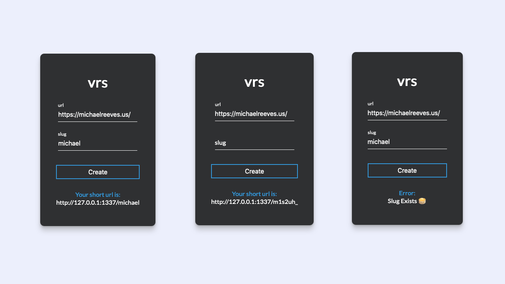

# vrs-url-shortner
Simple url shortner called vrs, provided with ability to create your own slug or not.

## Technologies

Built using NodeJS for the backend with the express framework, VueJS frontend alongside a mongoDB database,

## Screenshot 

Note: vrs.ws would be a prefered domain to replace 127.0.0.1 😉




## Install

Clone the project, then run:

```
npm i 
npm run dev
```

## Credits

Styling for form provided by: [alphardex](https://codepen.io/alphardex)

Inspired by: [cdg (CJ) ](https://cdg.sh/)
